# DART·K-IFRS Copilot
OpenDART 공시·재무제표 데이터와 K-IFRS 회계기준서를 결합하여, 사용자의 자연어 질문을 분석하고 근거가 포함된 답변을 제공하는 회계·재무 특화 AI 시스템입니다.

---

### 이 프로젝트로 할 수 있는 것
1. 사업보고서 요약
2. 동종업종 비교분석
3. 다년도 시계열 추세 분석
4. 정정공시 변경사항 추출
5. K-IFRS 회계기준을 인용한 분석 제공

---

### 기술 스택
- Backend: `FastAPI`
- Orchestration: `LangGraph`
- MCP Servers:
    - DART OpenAPI MCP
    - K-IFRS RAG MCP
- Frontend: `Streamlit`
- PDF 처리:
    - 텍스트 추출: `PyMuPDF`
- XML 처리:
    - `BeautifulSoup`
- 벡터 DB(RAG): `Chroma` (`langchain-chroma`)
- LLM: `langchain-openai`
- 데이터 소스: 
    - [OpenDART](https://opendart.fss.or.kr)
    - [한국회계기준원](https://www.kasb.or.kr) — K-IFRS 기준서 PDF (사전 임베딩)
- Agent / Tool Integration
    - MCP
    - Codex Plugin
    - Codex Skill (`SKILL.md`)
---

### 프로젝트 구조
```text
DartCopilot/
    plugins/
        dart-copilot/
            codex-plugin/
                plugin.json
            skills/
                dart-kifrs-analysis/
                    SKILL.md
            .mcp.json
    app/
      main.py            # FastAPI 엔트리포인트, /api/dart/query 라우트
      graph.py           # LangGraph Supervisor
      models.py          # Pydantic State / 데이터 모델
      llm_utils.py       # .env 로드 + LLM 클라이언트 생성
    mcp_servers/
        dart_server.py    # FastMCP 기반 DART OpenAPI MCP 서버
        kifrs_server.py   # FastMCP 기반 K-IFRS RAG MCP 서버
    scripts/
        build_industry_cache.py
        build_kifrs_index.py
        kifrs_search_test.py
        OpenDART_API_test.py
        OpenDART_document_test.py
    docs/
        devlog/           # 개발일지
    cache/                
        {corp_code}/      # 회사별 DART 다운로드 캐시
        kifrs/            # K-IFRS PDF(63개)
        kifrs_chroma/     # ChromaDB 임베딩
        CORPCODE.xml
        industry_codes.json
    streamlit_app.py      # Streamlit UI
    requirements.txt      
    .env
```

---

### 동기
일반적인 생성형 AI를 전문적인 업무에 활용하기 위해서 환각을 해결하고 답변이 검증가능하게 만들어야 한다고 판단하였다. 회계·재무 업무 수행 시 필요한 정보를 빠르게 검색할 수 있는 기능을 구현하고자 하였다.

---

### K-IFRS RAG 검색 방식 비교

사전에 정답 기준서를 지정한 30개 자연어 회계 질문을 대상으로 정답 기준서가 상위 검색 결과에 포함되는지를 평가하였다.  

| 검색 방식 | Standard Recall@1 | Standard Recall@3 |
|:---|---:|---:|
| BM25 | 73.3% | 90.0% |
| Vector Search | 86.7% | 100.0% |
| Hybrid Search | 76.7% | 93.3% |

평가 결과에 따라 Vector Search 적용하였다.

---

### K-IFRS 문단 단위 검색 정확도 검증

실제 답변에 필요한 문단을 제대로 검색하는지 확인하기 위해 실무형 질문 25개로 추가 평가. 사용자 질문을 LLM이 회계
검색어로 변환한 뒤 Vector Search를 수행했으며, 변환 결과가 매번 달라질 수 있어 총 5회 반복했다.

| 평가 지표 | 평균 | 최저 | 최고 |
|:---|---:|---:|---:|
| Paragraph Recall@1 | 42.4% | 36.0% | 52.0% |
| Paragraph Recall@3 | 81.6% | 72.0% | 88.0% |
| Paragraph Recall@5 | 88.0% | 80.0% | 96.0% |
| Paragraph Recall@8 | 91.2% | 88.0% | 96.0% |
| MRR | 0.616 | 0.550 | 0.703 |

25개 중 21개 문항은 5회 모두 정답 문단 검색에 성공했다.
검색어를 짧게 만드는 few-shot 프롬프트도 테스트했으나, 불필요한 표현과 함께 정답 판단에 필요한 조건까지 제거되는 경우가 있었다. 검색어의 간결성과 정보 보존 사이에 trade-off가 있음을 확인했다.
따라서 기존 Supervisor multi-agent 구조로 정답률이 낮은 6문항들을 제대로 검색 가능할지 추가로 테스트했다.

-> K-IFRS 전문 에이전트가 검색 결과를 확인하면서 검색어를 바꾸어 재검색했고(2~4회), 단일 검색에서 불안정했던 문항에서도 관련 문단을 근거로 답변을 생성했다. 멀티에이전트가 답변 품질에 실질적 효과가 있음을 확인했다. 

---

### 최종 산출물 (예시)
#### 1) 사업보고서 요약


---

#### 2) 동종업종 비교분석

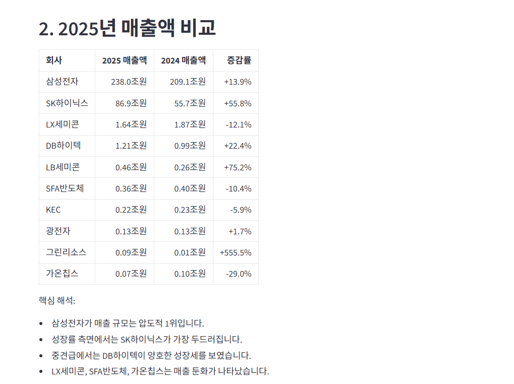
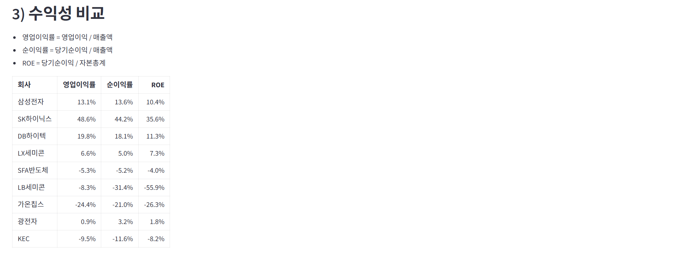

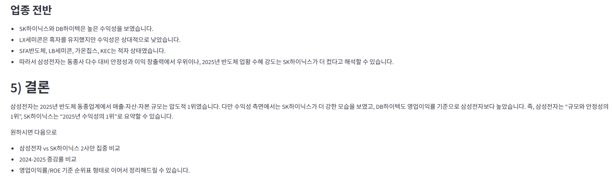

---

#### 3) 다년도 시계열 추세 분석
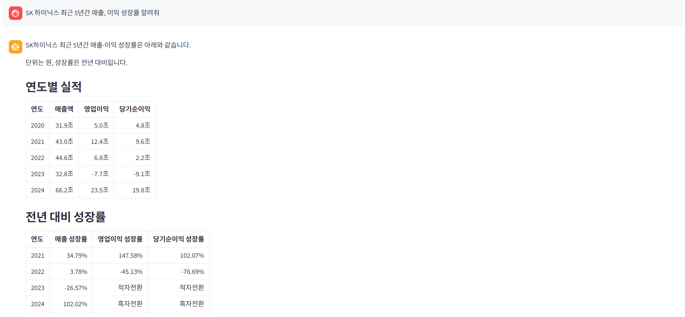 
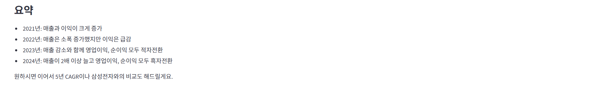 

---

#### 4) 정정공시 변경사항 추출
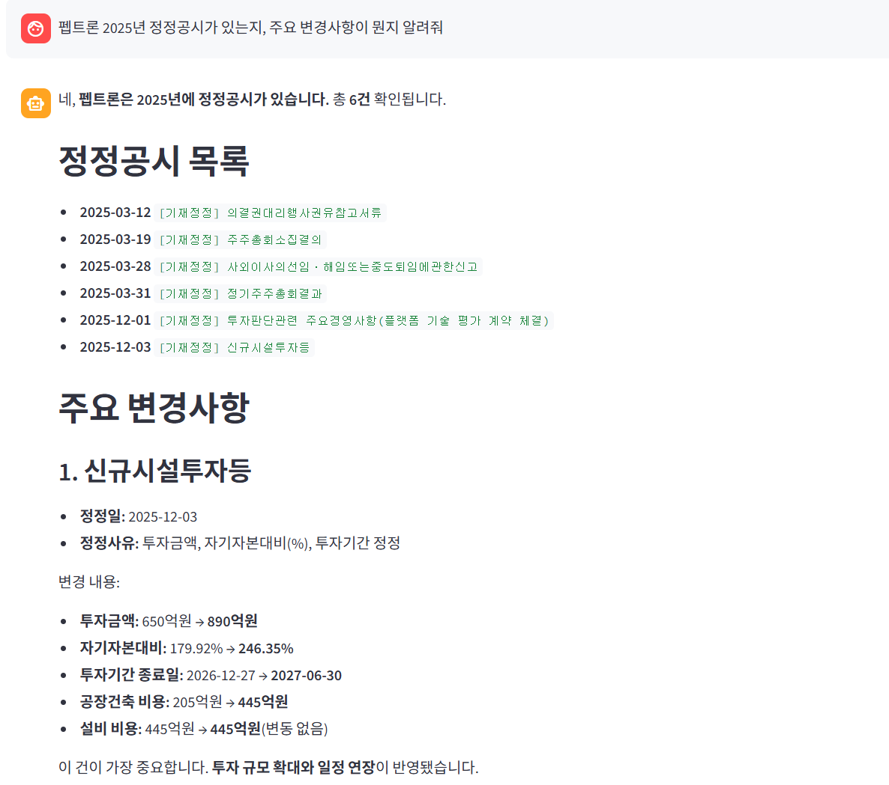
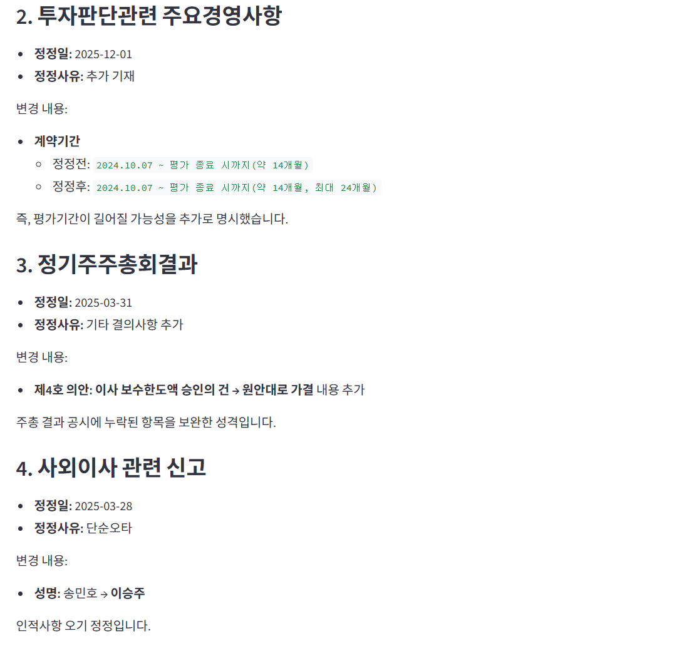
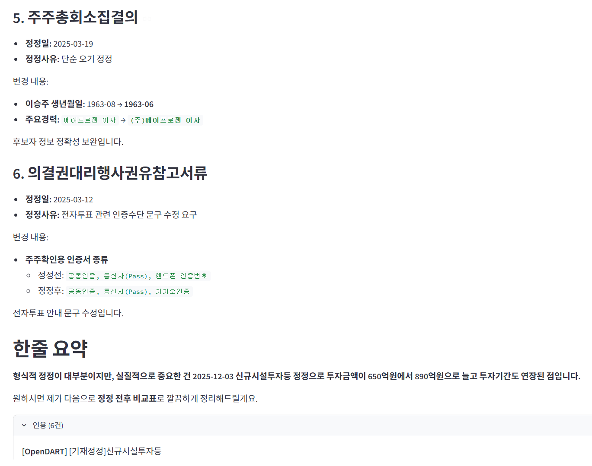

---

#### 5) K-IFRS 회계기준을 인용한 분석 제공
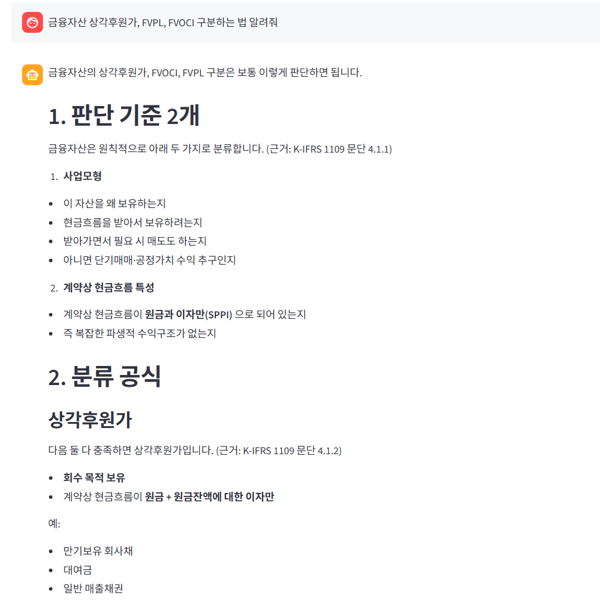
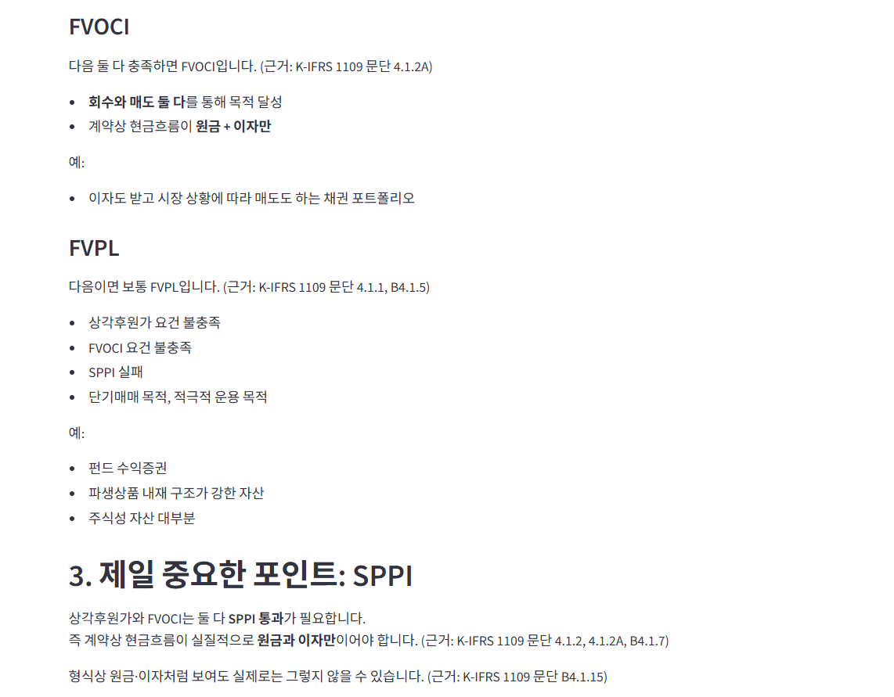
  
<br>
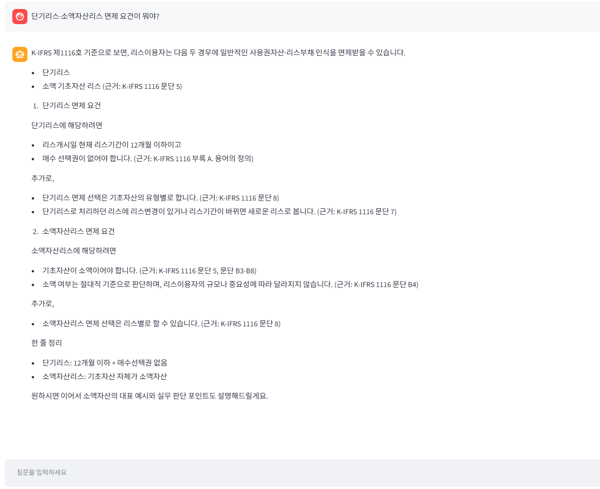  
 
---

#### Codex Plugin


> Q: 삼성전자와 같은 반도체 기업의 2025년 재무지표를 비교해줘.