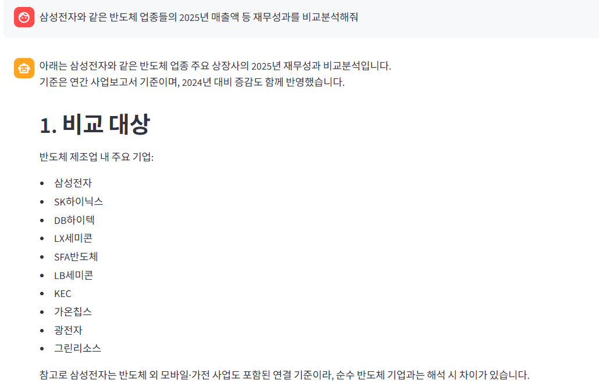
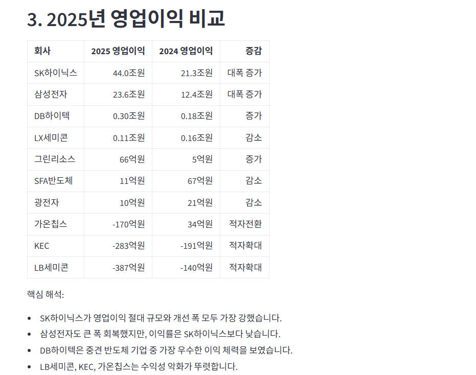
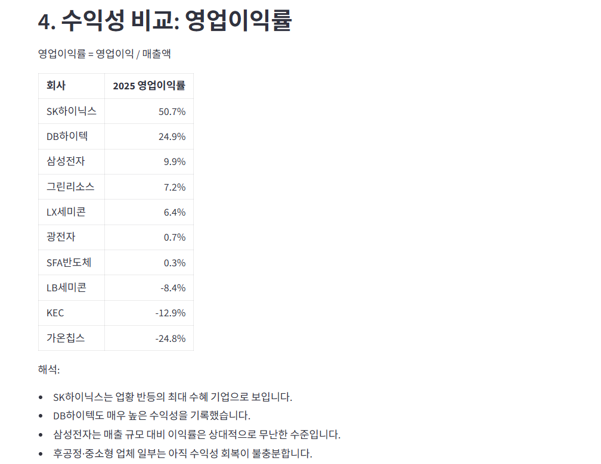
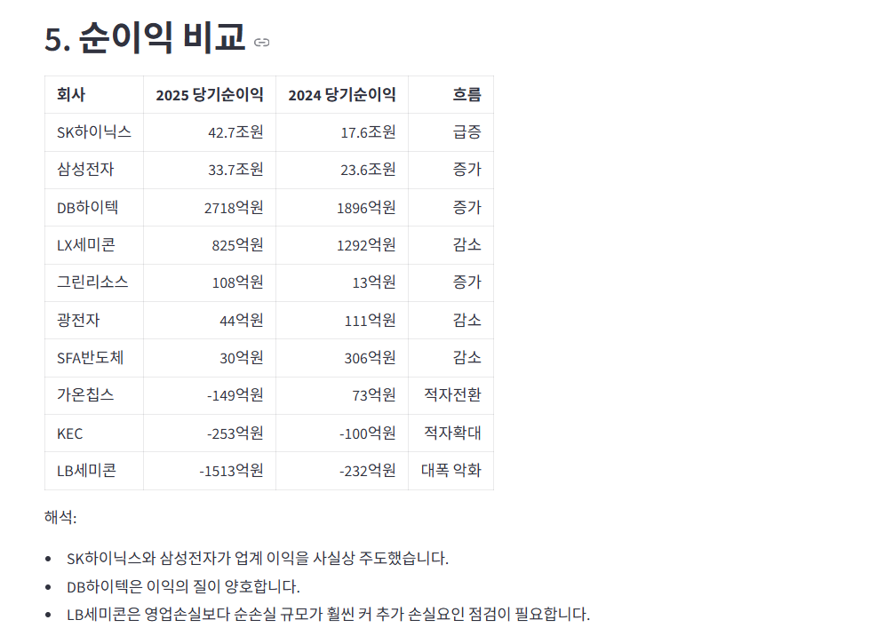
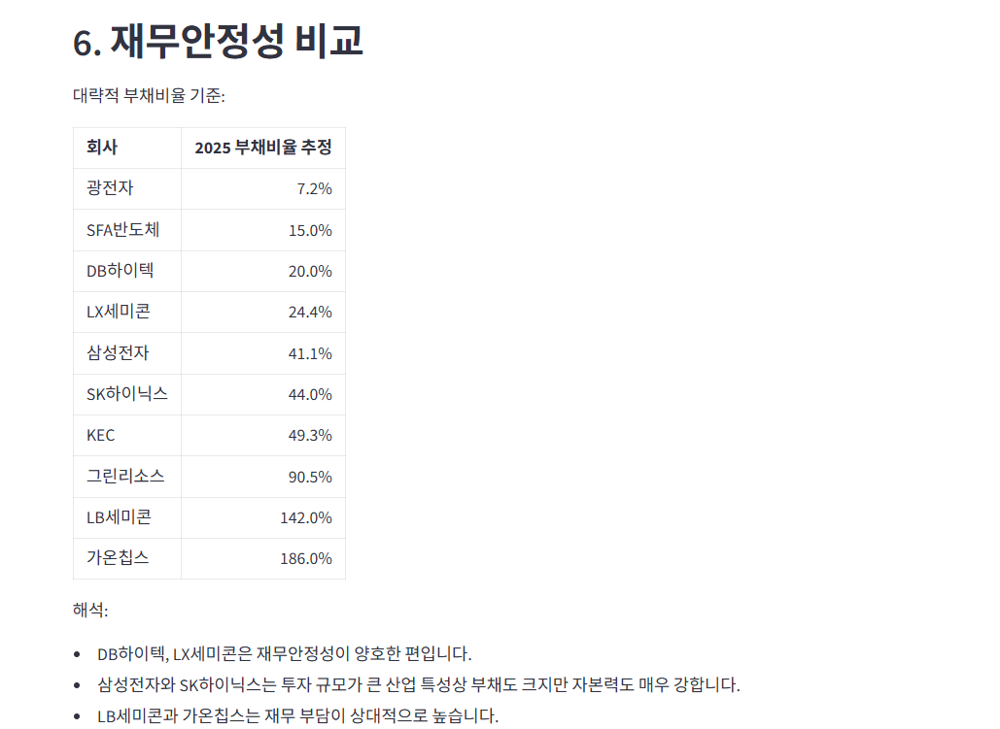
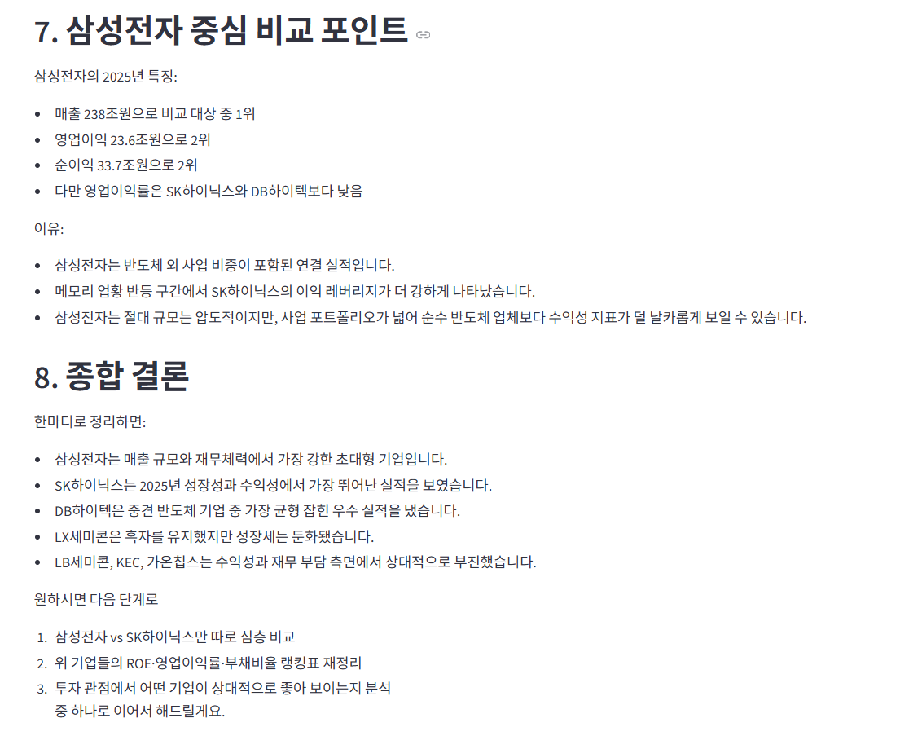
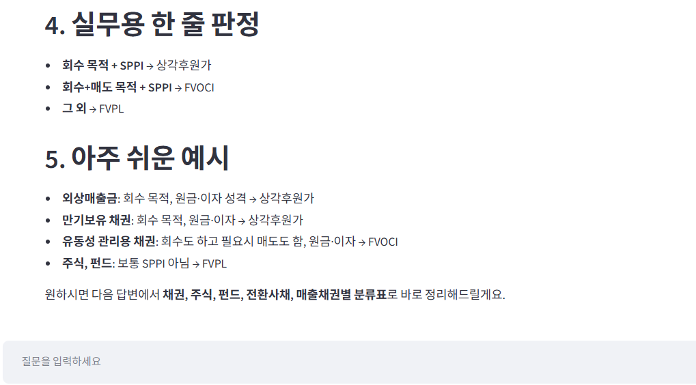
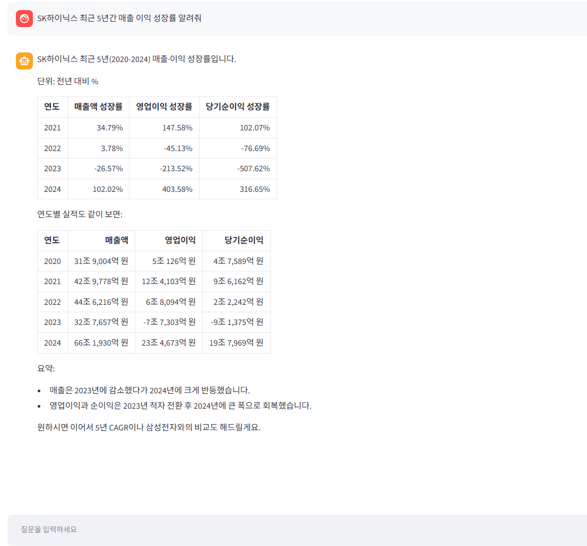
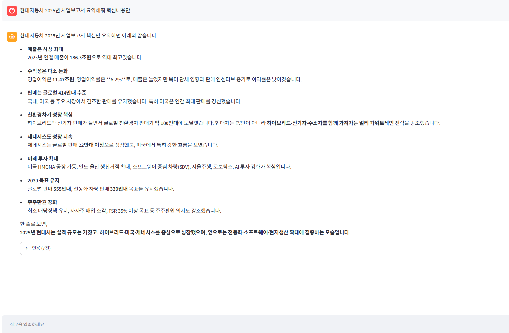
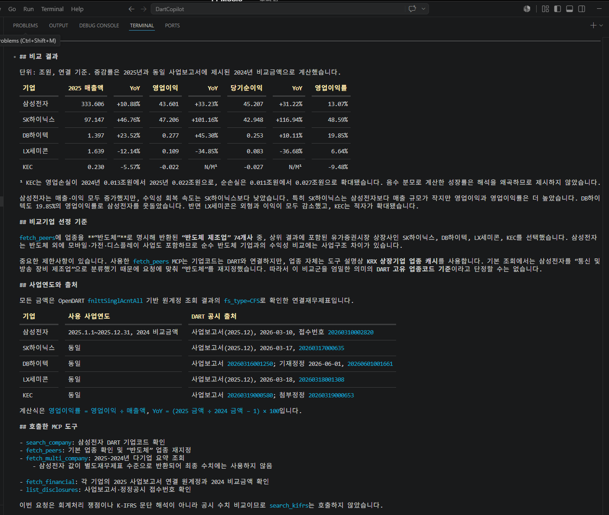

# DART·K-IFRS Copilot
OpenDART 공시·재무제표 데이터와 K-IFRS 회계기준서를 결합하여, 사용자의 자연어 질문을 분석하고 근거가 포함된 답변을 제공하는 회계·재무 특화 AI 시스템입니다.

---

### 이 프로젝트로 할 수 있는 것
1. 사업보고서 요약
2. 재무비율 산출
3. 동종업종 비교분석
4. 다년도 시계열 추세 분석
5. 정정공시 변경사항 추출
6. K-IFRS 회계기준을 인용한 분석 제공

---

### 기술 스택
- Backend: `FastAPI`
- Orchestration: `LangGraph`
- MCP Servers:
    - DART OpenAPI MCP
    - K-IFRS RAG MCP
- Frontend: `Streamlit`
- PDF 처리:
    - 텍스트 추출: `PyMuPDF`
- XML 처리:
    - `BeautifulSoup`
- 벡터 DB(RAG): `Chroma` (`langchain-chroma`)
- LLM: `langchain-openai`
- 데이터 소스: 
    - [OpenDART](https://opendart.fss.or.kr)
    - [한국회계기준원](https://www.kasb.or.kr) — K-IFRS 기준서 PDF (사전 임베딩)

---

### 프로젝트 구조
```text
DartCopilot/
    app/
      main.py            # FastAPI 엔트리포인트, /api/dart/query 라우트
      graph.py           # LangGraph Supervisor
      models.py          # Pydantic State / 데이터 모델
      llm_utils.py       # .env 로드 + LLM 클라이언트 생성
    mcp_servers/
        dart_server.py    # FastMCP 기반 DART OpenAPI MCP 서버
        kifrs_server.py   # FastMCP 기반 K-IFRS RAG MCP 서버
    scripts/
        build_industry_cache.py
        build_kifrs_index.py
        kifrs_search_test.py
        OpenDART_API_test.py
        OpenDART_document_test.py
    docs/
        devlog/           # 개발일지
    cache/                
        {corp_code}/      # 회사별 DART 다운로드 캐시
        kifrs/            # K-IFRS PDF(63개)
        kifrs_chroma/     # ChromaDB 임베딩
        CORPCODE.xml
        industry_codes.json
    streamlit_app.py      # Streamlit UI
    requirements.txt      
    .env
```

---

### 동기
일반적인 생성형 AI를 전문적인 업무에 활용하기 위해서 환각을 해결하고 답변이 검증가능하게 만들어야 한다고 판단. 회계·재무 업무 수행 시 필요한 정보를 빠르게 검색할 수 있는 챗봇을 제작하고자 함.

---

### 최종 산출물 (예시)
#### 1) 동종업종 비교






  

#### 2) 기준서 인용


  
<br>
  

#### 3) 다년간 성장률
  

#### 4) 사업보고서 요약


#### Codex Plugin

